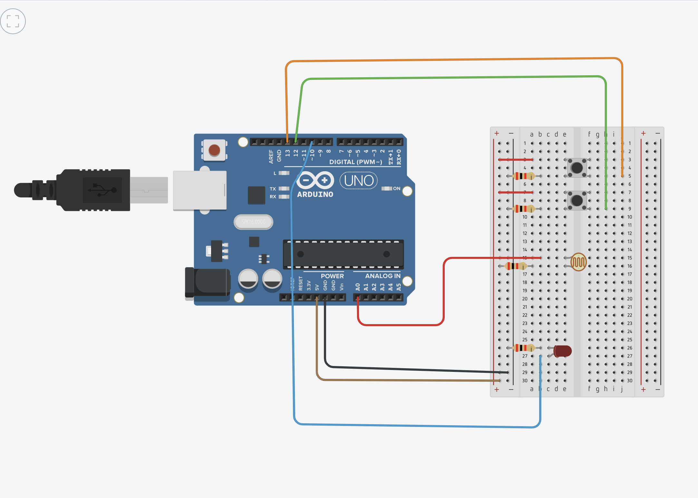

# Project description
## Arduino Light Sensor project

The project uses a light sensor to turn on a button when the signal read by the sensor is beyond a certain threshold.
The circuit uses two push-buttons to calibrate the threshold, making it usable in multiple light conditions. 2 digital input pins are used for the push-buttons' input, as well as one analog input for the light sensor. Another pin is used for digital output, turning on the LED when the condition is met.

# Schematic

# Prerequisites

* Arduino Uno R3 (https://www.emag.ro/placa-dezvoltare-arduino-uno-r3-arduinor3fa/pd/DRW27GBBM/)
* Light intensity sensor (Reference number: YQZBML_Mod-light)(https://ardushop.ro/ro/home/88-modul-senzor-lumina-intensitate-luminoasa.html?gclid=Cj0KCQjw3v6SBhCsARIsACyrRAkL6BDZr6PAUIXy7Iqa3mJUOuuShM50G3GHSra8a1VnDri3lhVSG_waAp_QEALw_wcB)
* 2 push buttons (the link is not the exact model but any push button will do)(https://ardushop.ro/ro/home/97-buton-mic-push-button-trough-hole.html?gclid=Cj0KCQjw3v6SBhCsARIsACyrRAl4H2W_TPTQuIM9CEcFgzJcmpnGczMO0VHuBqMAmjb9EHYqoe-AzckaAqgbEALw_wcB)
* 4 - 2,2k Ohm resistors (https://www.emag.ro/rezistenta-2-2k-0-25w-161352/pd/DRWV3BMBM/)
* Male to male jumper cables (https://ro.farnell.com/pro-signal/psg-jmp150mm/jumper-cable-150mm-dev-board-pk10/dp/2452750?gclid=Cj0KCQjw3v6SBhCsARIsACyrRAntTrLU82vMh9i74t0FW4qIKgmhhLHq7eAgtOBZdzWtny0lD758HUcaAvx-EALw_wcB&mckv=nqz3GuYn_dc|pcrid|580660128891|&CMP=KNC-GRO-GEN-SHOPPING-Whoop-7-June-2021&gross_price=true)

# Setup and build

The circuit will be assembled according to the schematic, then with the arduino board connected via USB, the code will be uploaded via the arduino IDE.

# Running steps

* With the board connected to power, use the push buttons to calibrate the threshold at with the LED will turn on. The current threshold, as well as the sensor reading will be printed to the Serial Monitor, visible in the arduino IDE.
* After the threshold has been calibrated, covering the sensor or removing enough light will cause the LED to power on, removing the cover will cause the LED to turn off again.

# Demo - video capture (uploaded to teams assignment)